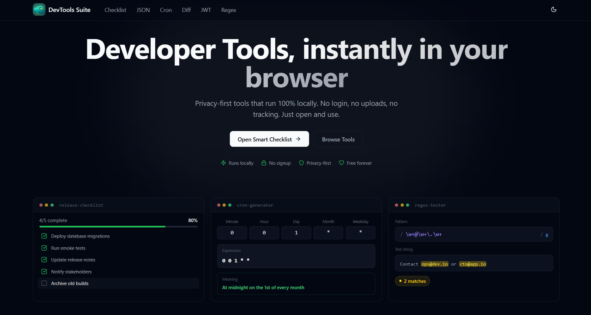
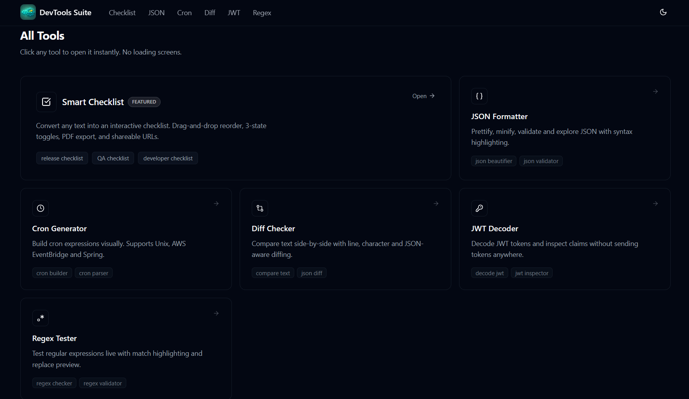
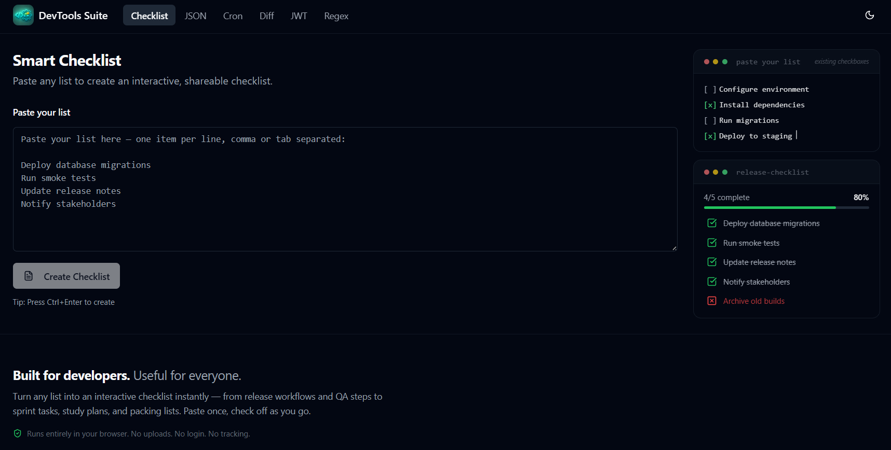
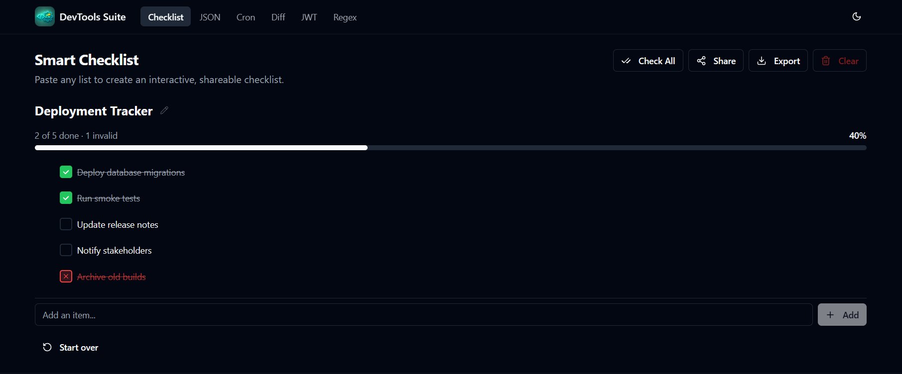
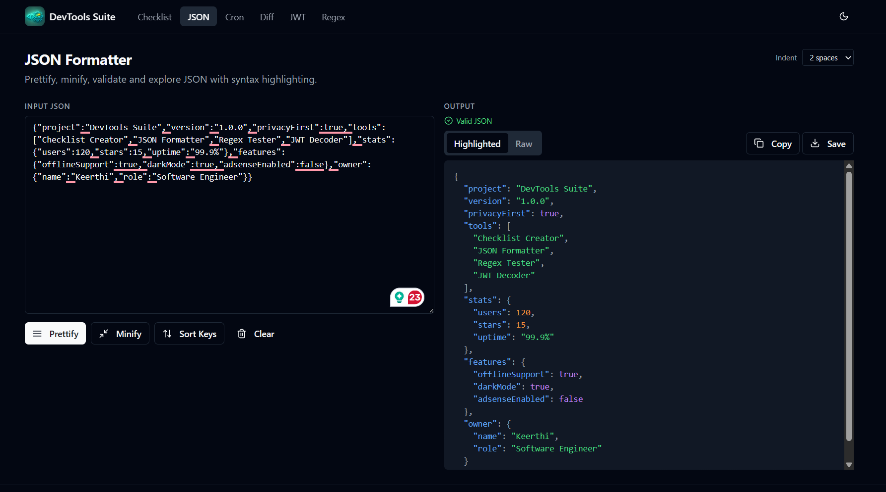
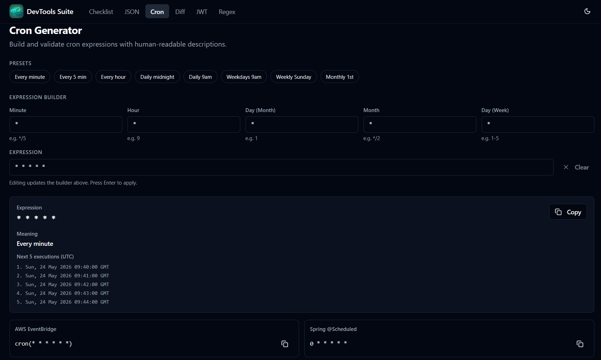
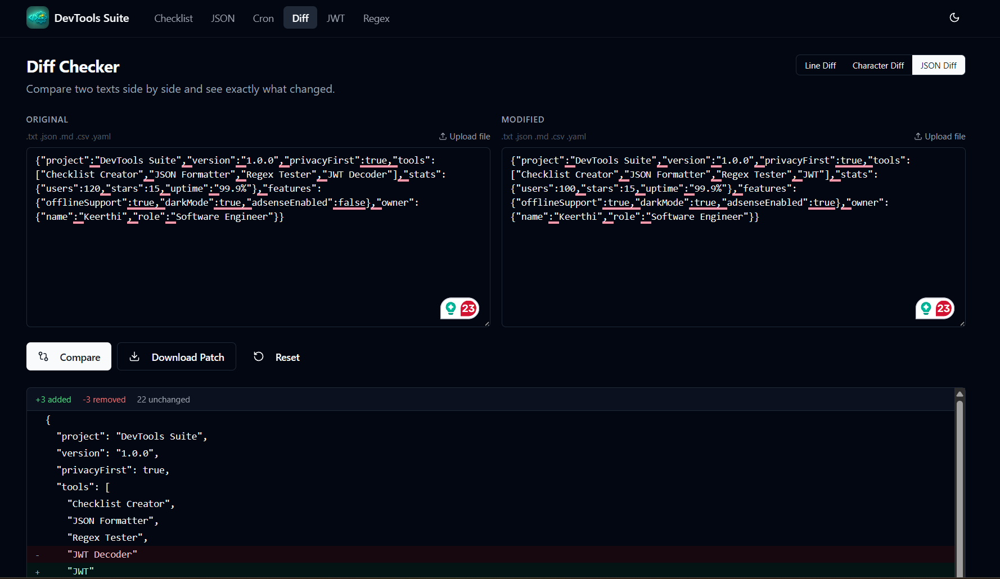
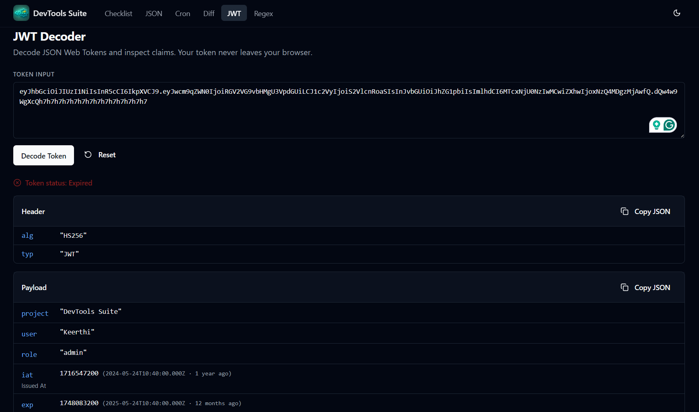
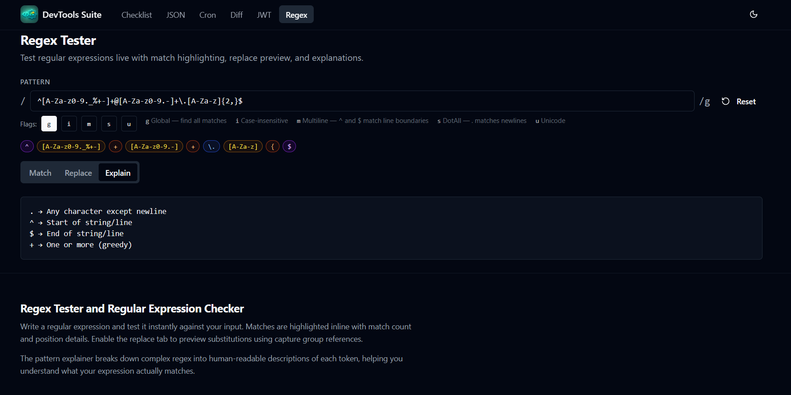

# DevTools Suite

> Free, privacy-first developer tools that run entirely in your browser.

**[devtoolssuite.dev](https://devtoolssuite.dev)** — No login. No uploads. No tracking.

---

## Demo

https://github.com/user-attachments/assets/ce40bfe3-260f-47ec-b867-24a3e925c47f

---

## Screenshots

| | |
|---|---|
|  |  |
|  |  |
|  |  |
|  |  |
|  | |

---

## Tools

### Phase 1 — Core Tools

| Tool | Description |
|------|-------------|
| [Smart Checklist](https://devtoolssuite.dev/checklist) | Two-mode checklist system — Simple mode converts any flat list instantly; Advanced mode supports 3-level nested tasks with collapse/expand, per-parent progress tracking, indent/outdent, drag-and-drop reorder within levels, PDF/Markdown/JSON/CSV export, and shareable URLs with mode preserved |
| [JSON Formatter](https://devtoolssuite.dev/json-formatter) | Prettify, minify, validate and explore JSON with syntax highlighting |
| [Cron Generator](https://devtoolssuite.dev/cron-generator) | Build cron expressions visually with human-readable descriptions and next-execution previews |
| [Diff Checker](https://devtoolssuite.dev/diff-checker) | Compare two texts side by side with line, character, and JSON-aware diff modes |
| [JWT Decoder](https://devtoolssuite.dev/jwt-decoder) | Decode JWT tokens and inspect header, payload, and expiry claims |
| [Regex Tester](https://devtoolssuite.dev/regex-tester) | Test regular expressions live with match highlighting, flags, and replace preview |

### Phase 2 — Expanded Utilities

| Tool | Description |
|------|-------------|
| [Base64 Encoder/Decoder](https://devtoolssuite.dev/base64-encoder-decoder) | Encode and decode Base64 strings and files in the browser |
| [UUID Generator](https://devtoolssuite.dev/uuid-generator) | Generate v1, v4, and v5 UUIDs in bulk with copy support |
| [URL Encoder/Decoder](https://devtoolssuite.dev/url-encoder-decoder) | Encode and decode URL components and full URLs |
| [Markdown Previewer](https://devtoolssuite.dev/markdown-previewer) | Write and preview Markdown with GFM support and sanitised HTML output |
| [SQL Formatter](https://devtoolssuite.dev/sql-formatter) | Beautify and minify SQL queries across dialects |
| [Color Converter](https://devtoolssuite.dev/color-converter) | Convert between HEX, RGB, HSL, and HSV color formats |
| [Hash Generator](https://devtoolssuite.dev/hash-generator) | Generate MD5, SHA-1, SHA-256, and SHA-512 hashes from text or files |
| [YAML ↔ JSON Converter](https://devtoolssuite.dev/yaml-json-converter) | Convert between YAML and JSON formats with validation |

### Phase 3 — Developer Essentials

| Tool | Description |
|------|-------------|
| [JSON → TypeScript](https://devtoolssuite.dev/json-ts-generator) | Generate TypeScript interfaces from JSON with optional Zod schema output |
| [CSV ↔ JSON](https://devtoolssuite.dev/csv-json-converter) | Convert between CSV and JSON with delimiter detection and header mapping |
| [Timestamp Converter](https://devtoolssuite.dev/timestamp-converter) | Convert Unix timestamps to human-readable dates and vice versa across timezones |
| [Case Converter](https://devtoolssuite.dev/case-converter) | Convert text between camelCase, snake_case, PascalCase, kebab-case, and more |
| [Password Generator](https://devtoolssuite.dev/password-generator) | Generate strong passwords with configurable length, character sets, and entropy display |
| [JWT Generator](https://devtoolssuite.dev/jwt-generator) | Sign and build JWT tokens with custom headers, payloads, and HS256/HS384/HS512 algorithms |
| [XML Formatter](https://devtoolssuite.dev/xml-formatter) | Beautify and minify XML with validation and error highlighting |
| [QR Code Generator](https://devtoolssuite.dev/qr-code-generator) | Generate QR codes from any text or URL with size and error-correction controls |

### Phase 4 — Advanced Tools

| Tool | Description |
|------|-------------|
| [JSON → Zod Schema](https://devtoolssuite.dev/json-zod-generator) | Generate Zod schemas from JSON with strict mode and inferred TypeScript types |
| [Flexbox Playground](https://devtoolssuite.dev/flexbox-playground) | Visually configure CSS Flexbox properties and copy generated CSS |
| [API Request Builder](https://devtoolssuite.dev/api-request-builder) | Build and send HTTP requests with params, headers, and body editors; imports cURL commands |
| [JSON Schema Generator](https://devtoolssuite.dev/json-schema-generator) | Generate JSON Schema draft 2020-12 from any JSON object |
| [Bcrypt Generator](https://devtoolssuite.dev/bcrypt-generator) | Hash and verify passwords with bcrypt entirely in the browser |
| [OpenAPI Viewer](https://devtoolssuite.dev/openapi-viewer) | Paste or upload an OpenAPI 3.x spec and browse endpoints interactively |
| [Tailwind Playground](https://devtoolssuite.dev/tailwind-playground) | Write HTML with Tailwind classes and preview the result live |
| [JSON → Dart](https://devtoolssuite.dev/json-to-dart) | Generate Dart model classes from JSON with null safety and fromJson/toJson support |
| [JSON → C#](https://devtoolssuite.dev/json-to-csharp) | Generate C# classes from JSON with GUID detection, nullable types, and namespace support |
| [Docker Compose Formatter](https://devtoolssuite.dev/docker-compose-formatter) | Beautify or minify docker-compose YAML files with human-friendly validation errors |

---

## How It Was Built

This project was designed and built using **[SpecKit](https://github.com/speckit-dev/speckit)** — an AI-assisted software specification and implementation workflow that runs inside Claude Code.

### Workflow

```
/speckit-specify → /speckit-plan → /speckit-tasks → /speckit-implement
```

1. **`/speckit-specify`** — Translated a plain-English product brief into a structured feature spec: user stories, acceptance criteria, success metrics, and edge cases.
2. **`/speckit-plan`** — Generated the full technical implementation plan: folder structure, component architecture, SEO strategy, shared utilities, and monetisation approach.
3. **`/speckit-tasks`** — Broke the plan into a prioritised task list organised by user story, with parallelism markers and file-level granularity.
4. **`/speckit-implement`** — Executed every task in sequence, writing production code file-by-file, respecting dependencies between phases.

All specs live in [`specs/001-devtools-suite-platform/`](specs/001-devtools-suite-platform/).

### Key Technical Decisions

| Decision | Rationale |
|---|---|
| Next.js App Router + SSG | SEO-indexable static HTML per tool page, Lighthouse 95+ |
| Zero backend | Privacy guarantee — no server ever receives user data |
| Browser-native Web Crypto API | SHA hashing without a backend or heavy library |
| Dynamic imports for heavy libs | `bcryptjs`, `js-yaml`, `papaparse`, `qrcode` loaded only when the tool is used |
| `localStorage` only | Persistence without accounts or databases |
| `display:none` AdSlot collapse | Keeps `<ins>` in DOM for AdSense while hiding unfilled slots |
| dnd-kit for drag-and-drop | Accessible, pointer + touch + keyboard sensor support |
| Plain `<script>` in `<head>` for AdSense | `next/script strategy="afterInteractive"` moves to body, breaking AdSense crawler verification |
| Human-friendly YAML errors | Source-scanning for `key:value` patterns before trusting js-yaml's parser position |
| cURL import parser | Custom tokenizer handles bash (`\\\n`), PowerShell (backtick), and `--json` flag across shell dialects |
| Flat array with `parentId` + `depth` for advanced checklist | Simpler dnd-kit integration than a recursive tree; `descendantsOf()` + `visibleItems()` handle collapse and cascade |
| Sibling-block reorder strategy | DnD moves item + entire descendant subtree as one atomic block using `arrayMove` on sibling groups |
| Ancestor state sync after toggle | After any item toggle, walk up `parentId` chain and derive each parent's state from its children's states |
| `mounted` guard for mode hydration | Server renders `'simple'`, `useEffect` reads localStorage; `mounted` flag prevents hydration mismatch |
| `?m=` param in share URL | Encodes active mode (simple/advanced) alongside checklist data so recipients open the correct view |

---

## Philosophy

- **Privacy first** — all processing happens locally in your browser. Your data never leaves your device.
- **Zero friction** — open a tool and use it immediately. No accounts, no onboarding, no paywalls.
- **Fast** — static pages, minimal JavaScript, optimized for instant load times.
- **Accessible** — keyboard navigation, screen reader support, dark/light mode.

---

## Tech Stack

- [Next.js 14](https://nextjs.org) — App Router, static generation (43 static pages)
- [TypeScript](https://www.typescriptlang.org) — strict mode with `noUncheckedIndexedAccess` and `exactOptionalPropertyTypes`
- [Tailwind CSS](https://tailwindcss.com) — utility-first styling
- [shadcn/ui](https://ui.shadcn.com) — accessible component primitives
- [@dnd-kit](https://dndkit.com) — drag-and-drop for the checklist (simple + advanced modes)
- [lz-string](https://github.com/pieroxy/lz-string) — LZString compression for checklist share URLs
- [jspdf](https://github.com/parallax/jsPDF) — client-side PDF export for both checklist modes
- [js-yaml](https://github.com/nodeca/js-yaml) — YAML parsing and formatting
- [bcryptjs](https://github.com/dcodeIO/bcrypt.js) — browser-compatible bcrypt hashing
- [papaparse](https://www.papaparse.com) — CSV parsing
- [fast-xml-parser](https://github.com/NaturalIntelligence/fast-xml-parser) — XML formatting
- [qrcode](https://github.com/soldair/node-qrcode) — QR code generation
- Deployed on [Vercel](https://vercel.com)

---

## Running Locally

```bash
git clone https://github.com/ksrilal/devtools-suite.git
cd devtools-suite
npm install
npm run dev
```

Open [http://localhost:3000](http://localhost:3000).

### Environment Variables

Create a `.env.local` file (optional — all tools work without these):

```env
NEXT_PUBLIC_SITE_URL=http://localhost:3000
NEXT_PUBLIC_ADSENSE_CLIENT_ID=    # Google AdSense publisher ID
NEXT_PUBLIC_GA_MEASUREMENT_ID=    # Google Analytics 4 measurement ID
```

---

## Project Structure

```
app/                        # Next.js App Router pages (one folder per tool)
  checklist/
  json-formatter/
  cron-generator/
  diff-checker/
  jwt-decoder/
  regex-tester/
  base64-encoder-decoder/
  uuid-generator/
  url-encoder-decoder/
  markdown-previewer/
  sql-formatter/
  color-converter/
  hash-generator/
  yaml-json-converter/
  json-ts-generator/
  csv-json-converter/
  timestamp-converter/
  case-converter/
  password-generator/
  jwt-generator/
  xml-formatter/
  qr-code-generator/
  json-zod-generator/
  flexbox-playground/
  api-request-builder/
  json-schema-generator/
  bcrypt-generator/
  openapi-viewer/
  tailwind-playground/
  json-to-dart/
  json-to-csharp/
  docker-compose-formatter/
components/
  tools/                    # Tool UI components
  home/                     # Homepage preview animations
  layout/                   # Nav, Footer
  ui/                       # Shared UI (Button, CopyButton, AdSlot, etc.)
lib/
  tools/                    # Core tool logic (pure functions, no React)
    checklist.ts            # Simple mode: parse, state transitions, encode/decode, export
    checklist-advanced.ts   # Advanced mode: nested tree utilities, indent/outdent, progress, encode/decode, export
  seo/                      # Metadata helpers (toolMetadata, webApplicationLD, faqPageLD)
```

---

## License

MIT — free to use, fork, and build upon.
